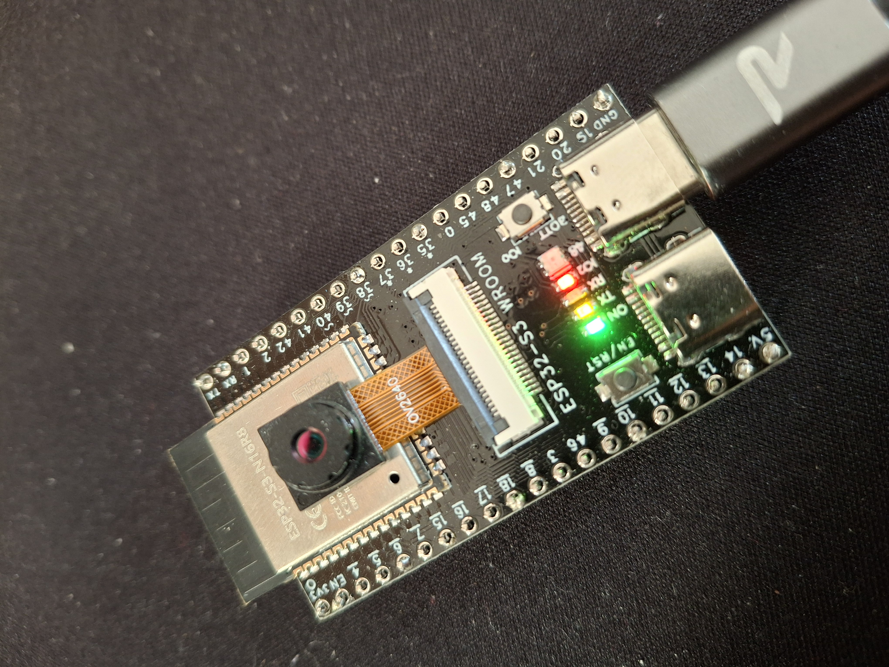

# ESP32 Person Detection Camera



This project implements a **real-time person detection camera** on an ESP32 board with PSRAM support. It captures images from an OV2640 camera, runs **TensorFlow Lite Micro** inference to detect the presence of a person, and serves the latest captured frame over an HTTP server. LEDs indicate detection status, and the system is designed for low-memory embedded environments.

## Table of Contents

- [Features](#features)
- [Hardware Requirements](#hardware-requirements)
- [Software Requirements](#software-requirements)
- [Build and Flash](#build-and-flash)
- [Usage](#usage)
- [Configuration](#configuration)
- [Project Structure](#project-structure)
- [Dependencies](#dependencies)
- [Troubleshooting](#troubleshooting)
- [License](#license)

## Features

- **Camera capture**: Periodically captures frames from an OV2640 camera module.
- **Person detection**: Uses a TensorFlow Lite Micro model to detect whether a person is present in the frame.
- **LED indicators**:
  - **Blue LED** – person detected
  - **Red LED** – no person detected
- **HTTP streaming**: Serve the latest captured frame at `/capture.jpg`.
- **PSRAM-aware memory allocation**: Uses external PSRAM for frame buffers and TensorFlow Lite arena when available.
- **Wi-Fi connectivity**: Connects to a specified Wi-Fi network and exposes a local HTTP server.
- **Automatic reboot**: Optional runtime limit to restart the device for reliability.

## Hardware Requirements

- ESP32 board with PSRAM support (e.g., ESP32-WROVER)
- OV2640 camera module
- RGB LEDs or separate blue/red LEDs for detection indicators
- USB cable for power supply and programming

## Software Requirements

- ESP-IDF v5.0 or later
- CMake
- Python 3.7 or later

## Build and Flash

1. Set the target chip:
   ```bash
   idf.py set-target esp32
   ```

2. Configure the project (optional, for custom settings):
   ```bash
   idf.py menuconfig
   ```

3. Build the project:
   ```bash
   idf.py build
   ```

4. Flash and monitor:
   ```bash
   idf.py -p <PORT> flash monitor
   ```

Replace `<PORT>` with your ESP32's serial port (e.g., COM3 on Windows or /dev/ttyUSB0 on Linux).

## Usage

1. Power on the ESP32 board.
2. The device will connect to the configured Wi-Fi network.
3. Once connected, note the IP address from the serial output.
4. Access the HTTP server at `http://<IP_ADDRESS>/capture.jpg` to view the latest captured frame.
5. The LEDs will indicate detection status: blue for person detected, red for no person.

## Configuration

The project uses default settings. You can modify `sdkconfig` or use `idf.py menuconfig` to adjust:
- Wi-Fi SSID and password
- Camera settings (resolution, flip)
- Detection interval
- HTTP server port
- LED GPIO pins

## Project Structure

- `main/`: Source code directory
  - `main.cpp`: Main application entry point
  - `gpio-config.h`: GPIO pin configurations
  - `network.h`: Network-related definitions
- `camera-driver/`: Camera initialization and capture
- `wifi/`: Wi-Fi management
- `led/`: LED control
- `psram/`: External memory management
- `image-editing/`: Frame resizing and cropping
- `http-server/`: HTTP server implementation
- `tf-lite/`: TensorFlow Lite Micro integration
- `tflite-person-detect/`: Person detection model
- `script/`: Utility scripts for model conversion
- `docs/`: Documentation and images
- `build/`: Build output directory
- `CMakeLists.txt`: Project build configuration
- `sdkconfig`: Project configuration file
- `partitions.csv`: Partition table

## Dependencies

- ESP-IDF components: FreeRTOS, Wi-Fi, HTTP server, camera driver
- Managed components: esp32-camera, esp-tflite-micro, esp-nn, esp-jpeg
- TensorFlow Lite Micro model: Person detection model (included)

## Troubleshooting

- Ensure the ESP32 target is set correctly: `idf.py set-target esp32`
- Check serial port permissions on Linux/macOS
- Verify camera module is properly connected
- For Wi-Fi issues, check SSID and password in configuration
- For build issues, clean and rebuild: `idf.py clean && idf.py build`
- Monitor serial output for debug information

For technical queries, please refer to the [ESP-IDF documentation](https://docs.espressif.com/projects/esp-idf/) or open an issue on the project repository.

## License

This project is licensed under the MIT License. See the LICENSE file for details.